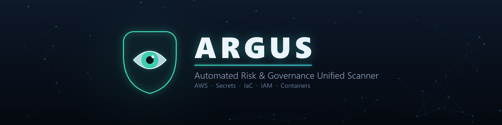
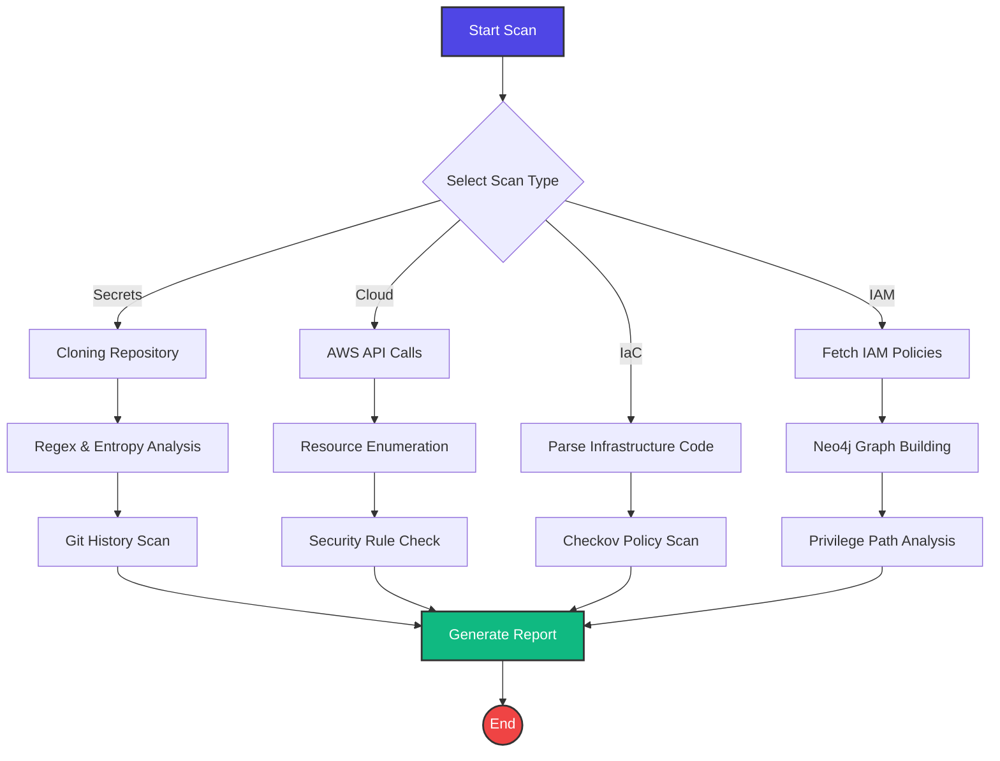
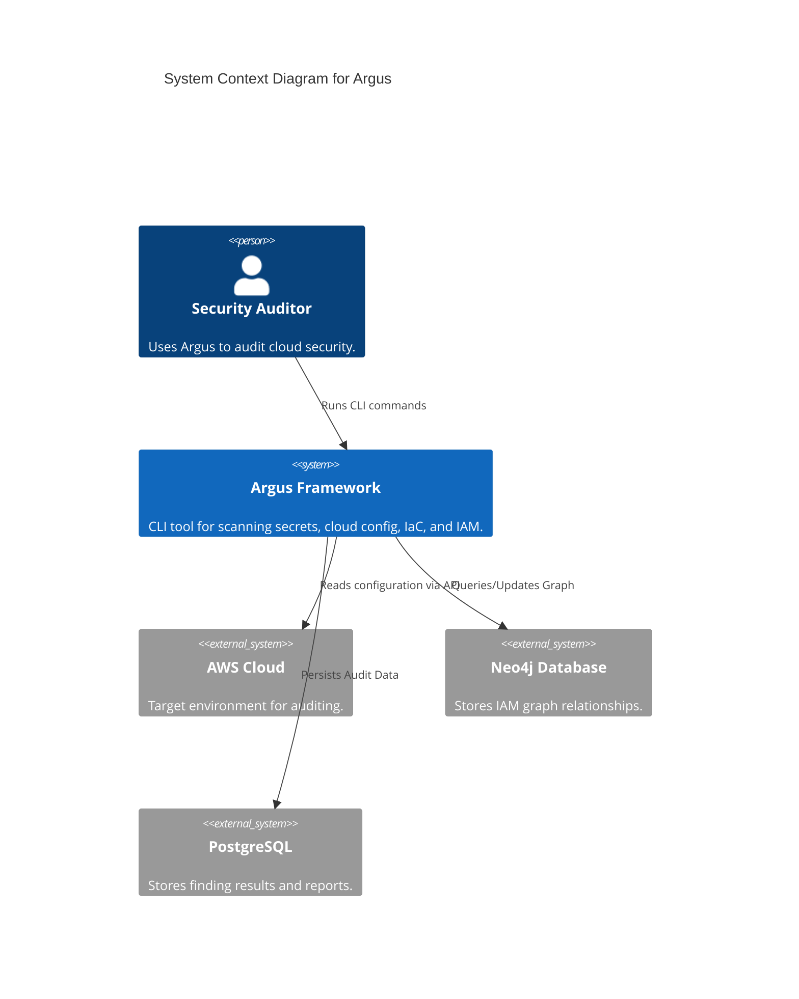

<p align="center">
  
</p>

# 🛡️ Argus Framework

<p align="center">
  <a href="https://github.com/Garyson26/Argus-Framework/blob/main/LICENSE">
    
  </a>
  <a href="https://github.com/Garyson26/Argus-Framework/commits/main">
    
  </a>
  <a href="https://github.com/Garyson26/Argus-Framework/issues">
    
  </a>
  <a href="https://pypi.org/project/argus-cloud/">
    
  </a>
  <a href="https://www.python.org/">
    
  </a>
</p>

<p align="center">
  <strong>Automated Risk & Governance Unified Scanner</strong>
  <br>
  The all-seeing AWS cloud security audit framework — <i>a hundred eyes on your infrastructure, never all asleep at once.</i> 👁️
</p>

<p align="center">
  <a href="#-key-features">Key Features</a> •
  <a href="#-how-it-works">How It Works</a> •
  <a href="#-installation">Installation</a> •
  <a href="#-quick-start">Quick Start</a> •
  <a href="#-usage-guide">Usage Guide</a> •
  <a href="CONTRIBUTING.md">Contributing</a>
</p>

---

## 🌟 Key Features

<table>
  <tr>
    <td width="50%">
      <h3>🔐 Secret Leak Detection</h3>
      <p>Scan repositories for hardcoded credentials with over 50+ patterns including AWS keys, API tokens, and private keys. Includes Shannon entropy detection.</p>
    </td>
    <td width="50%">
      <h3>☁️ AWS Misconfiguration</h3>
      <p>Comprehensive checks for S3, EC2, IAM, RDS, Lambda, VPC, and CloudTrail to ensure your cloud infrastructure follows best practices.</p>
    </td>
  </tr>
  <tr>
    <td width="50%">
      <h3>📜 IaC Scanning</h3>
      <p>Analyze Terraform, CloudFormation, Serverless, and Kubernetes files for security flaws before deployment using the Checkov engine.</p>
    </td>
    <td width="50%">
      <h3>👤 IAM Permission Analysis</h3>
      <p>Visualize and analyze IAM permissions to detect privilege escalation paths and overly permissive policies using graph-based mapping.</p>
    </td>
  </tr>
</table>

---

## 🔄 How It Works

Argus streamlines your security auditing workflow. Here is the process flow:



---

## 🚀 Installation

### Prerequisites

- **Python 3.9+**
- **Docker & Docker Compose** (for persistent storage)
- **AWS CLI** configured (for cloud scanning)

### Quick Install

```bash
# 1. Clone the repository
git clone https://github.com/Garyson26/Argus-Framework.git
cd Argus

# 2. Set up virtual environment
python -m venv .venv
source .venv/bin/activate  # On Windows: .venv\Scripts\activate

# 3. Install dependencies
pip install -e ".[dev]"

# 4. Start database services
docker-compose up -d postgres redis neo4j

# 5. Initialize database
argus init-db
```

---

## ⚡ Quick Start

Get up and running in seconds!

```bash
# 1. Verify installation
argus --version

# 2. Run a secret scan on a local repo
argus secret scan ./your-project

# 3. Scan your default AWS profile
argus cloud scan

# 4. View help for more commands
argus --help
```

---

## 📖 Usage Guide

### 🕵️ Secret Scanning
Find hidden secrets in your code, even deep in git history.

```bash
argus secret scan ./target-repo --history
```
**Options:**
- `--history`: Scan full git history
- `--entropy 4.5`: Set custom entropy threshold
- `--json`: Output results in JSON format

### ☁️ Cloud Auditing
Audit your AWS environment for security gaps.

```bash
argus cloud scan --profile production --regions us-east-1,us-west-2
```
**Options:**
- `--profile`: Specify AWS CLI profile
- `--services s3,ec2,iam`: Contextual scanning
- `--fix`: Attempt auto-remediation (Use with caution!)

### 🏗️ IaC Security
Shift left by scanning your infrastructure code.

```bash
argus iac scan ./terraform-files
```

### 🕸️ IAM Analysis
Visualize permission paths and find dangerous roles.

```bash
argus iam analyze --graph
```
*Note: Requires Neo4j service to be running.*

---

## 🏗️ Architecture

The Argus framework is built for modularity and scalability.



---

## 🤝 Community & Support

We welcome contributions! Please see our [Contributing Guide](CONTRIBUTING.md) for details.

- **Found a bug?** Open an [Issue](https://github.com/Garyson26/Argus-Framework/issues)
- **Security concern?** See [SECURITY.md](SECURITY.md)
- **Code of Conduct?** See [CODE_OF_CONDUCT.md](CODE_OF_CONDUCT.md)

---

## 📄 License

Argus is licensed under the [Apache License, Version 2.0](LICENSE).

It derives from *FuFuFaFa — Framework for Unified Flaw & Fault Auditing* by sudo3rs,
originally released under the MIT License. That notice is preserved in [NOTICE](NOTICE).

---

<p align="center">
  Made with ❤️ and ☕ by the Argus Team
</p>
