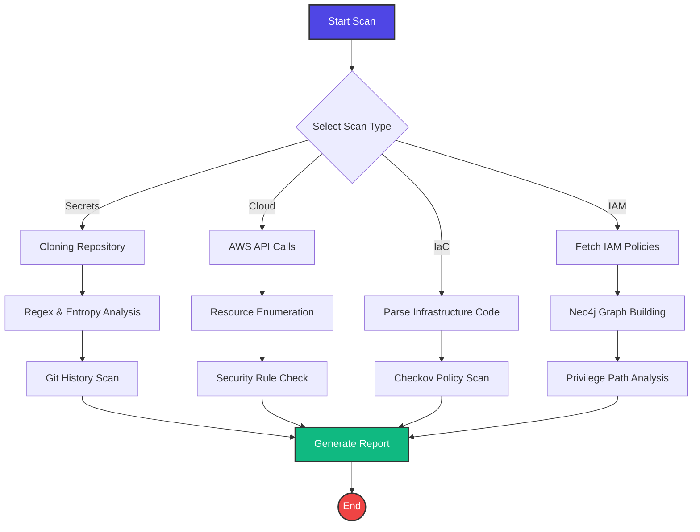

  

# 🛡️ Argus Framework

  <strong>Automated Risk & Governance Unified Scanner</strong>
   
  The all-seeing AWS cloud security audit framework — <i>a hundred eyes on your infrastructure, never all asleep at once.</i> 👁️

## 🌟 Key Features

<table>
  <tr>
    <td width="50%">
      <h3>🔐 Secret Leak Detection</h3>
      
Scan repositories for hardcoded credentials with over 50+ patterns including AWS keys, API tokens, and private keys. Includes Shannon entropy detection.

    </td>
    <td width="50%">
      <h3>☁️ AWS Misconfiguration</h3>
      
Comprehensive checks for S3, EC2, IAM, RDS, Lambda, VPC, and CloudTrail to ensure your cloud infrastructure follows best practices.

    </td>
  </tr>
  <tr>
    <td width="50%">
      <h3>📜 IaC Scanning</h3>
      
Analyze Terraform, CloudFormation, Serverless, and Kubernetes files for security flaws before deployment using the Checkov engine.

    </td>
    <td width="50%">
      <h3>👤 IAM Permission Analysis</h3>
      
Visualize and analyze IAM permissions to detect privilege escalation paths and overly permissive policies using graph-based mapping.

    </td>
  </tr>
</table>

---

## 🔄 How It Works

Argus streamlines your security auditing workflow. Here is the process flow:

```mermaid
graph TD
    A[Start Scan] --> B{Select Scan Type}
    
    B -->|Secrets| C[Cloning Repository]
    C --> D[Regex & Entropy Analysis]
    D --> E[Git History Scan]
    
    B -->|Cloud| F[AWS API Calls]
    F --> G[Resource Enumeration]
    G --> H[Security Rule Check]
    
    B -->|IaC| I[Parse Infrastructure Code]
    I --> J[Checkov Policy Scan]
    
    B -->|IAM| K[Fetch IAM Policies]
    K --> L[Neo4j Graph Building]
    L --> M[Privilege Path Analysis]
    
    E --> N[Generate Report]
    H --> N
    J --> N
    M --> N
    
    N --> O((End))
    
    style A fill:#4F46E5,stroke:#333,stroke-width:2px,color:#fff
    style N fill:#10B981,stroke:#333,stroke-width:2px,color:#fff
    style O fill:#EF4444,stroke:#333,stroke-width:2px,color:#fff
```

---

## 🚀 Installation

### Prerequisites

